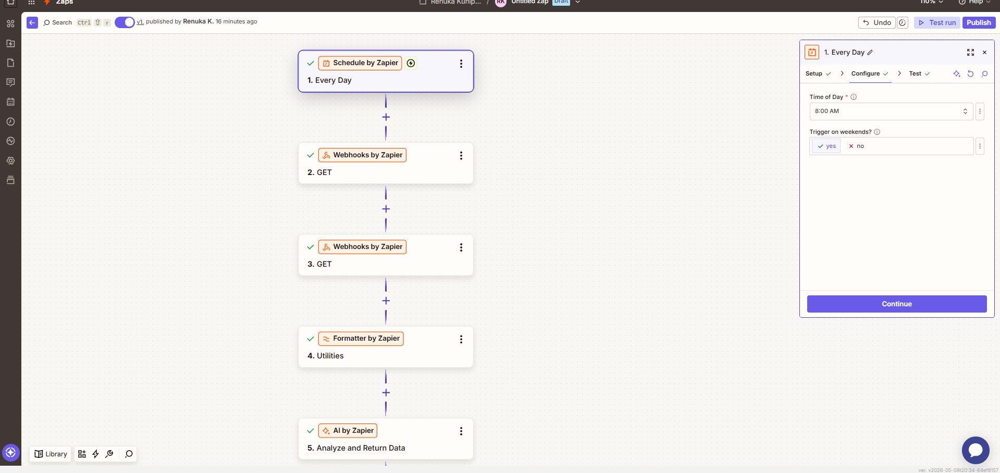
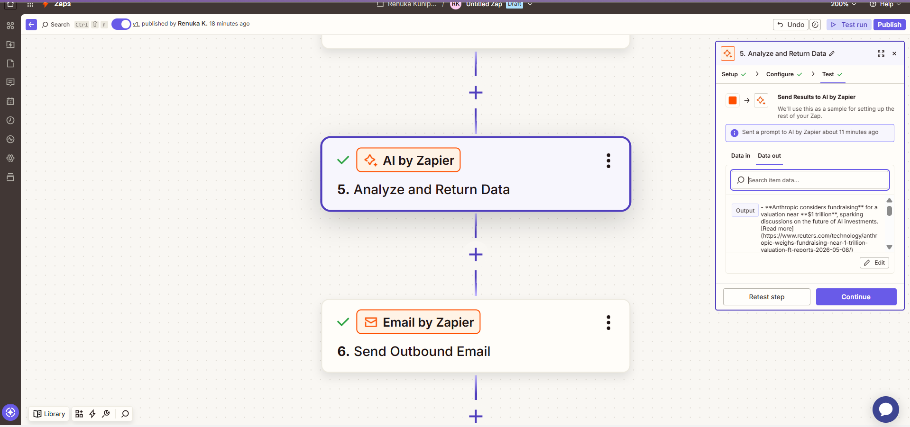
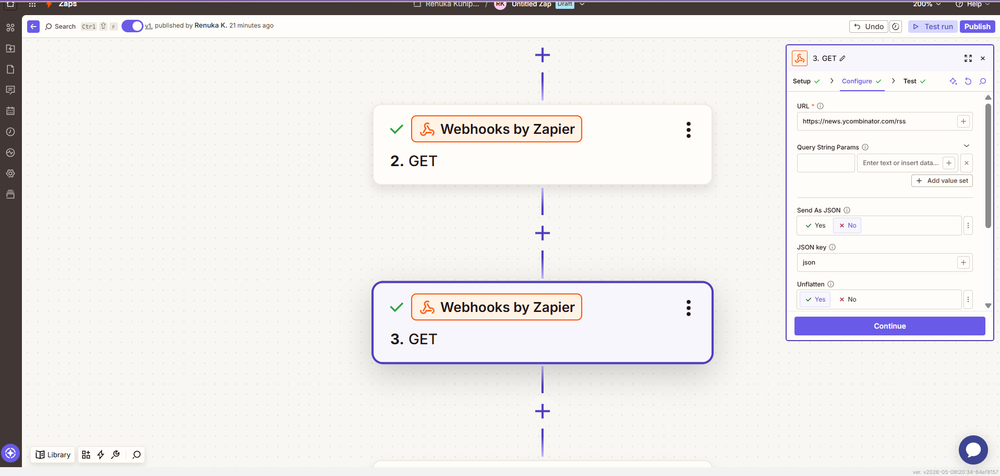
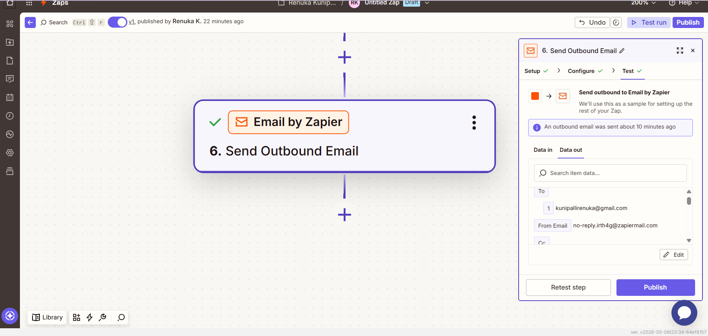

# AI Agent Automation using Zapier

This project demonstrates an AI-powered automation workflow built using Zapier.

## 🚀 Features
- Automated daily scheduling
- Webhook/API integration
- Data formatting
- AI analysis
- Automated outbound actions

## 🛠 Tools Used
- Schedule by Zapier
- Webhooks by Zapier
- Formatter by Zapier
- AI by Zapier

## 📌 Workflow

1. Trigger automation daily
2. Fetch data using webhooks
3. Format the incoming data
4. Analyze data using AI
5. Generate automated output

## 📷 Workflow Screenshot

## 🤖 AI Analysis

## 🌐 Webhook Configuration

## 📤 Output

## 👩‍💻 Author
Renuka K
